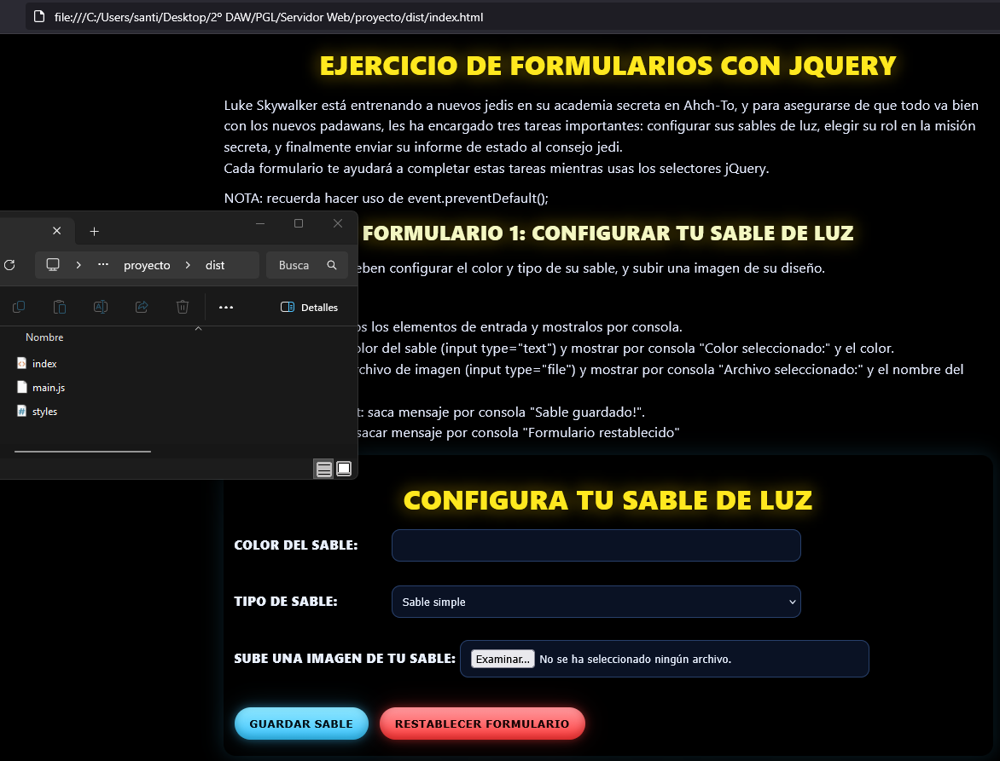
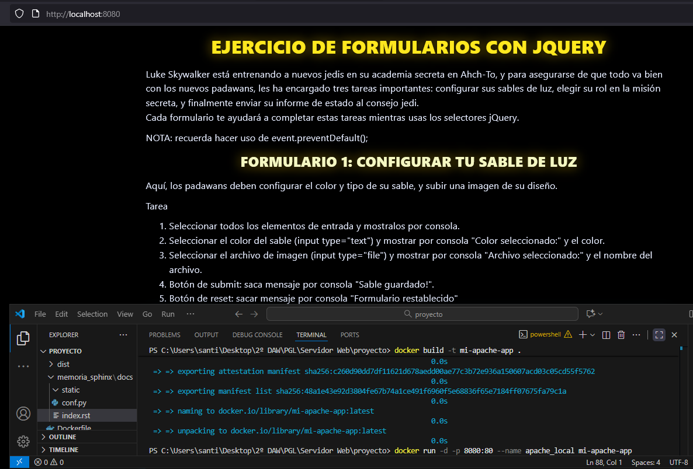
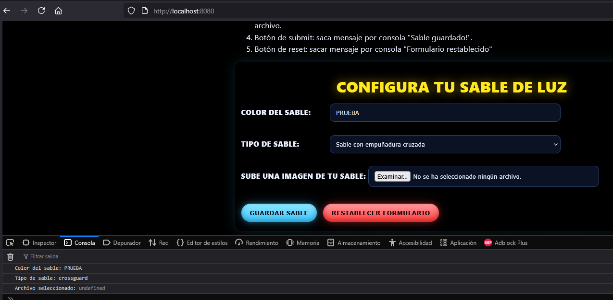
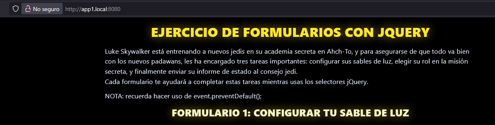
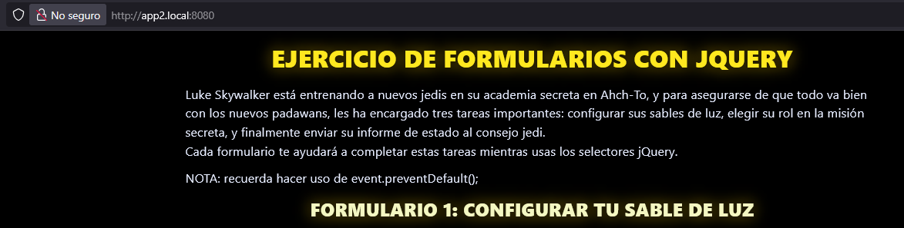

Memoria Técnica - Servidor Web Apache
====================================

Fase 1: Preparación del entorno web
-----------------------------------

- Carpeta de distribución: ``dist``
- Contiene HTML, CSS, JS.
- La app se puede abrir localmente en un navegador para verificar funcionamiento.
- **Descripción breve del funcionamiento:** Los formularios interactúan con el usuario mediante JS y se cargan recursos estáticos.

**Comandos locales de verificación:**

.. code-block:: bash

    # Abrir index.html localmente
    start dist/index.html   # Windows
    # o
    xdg-open dist/index.html  # Linux

---

Fase 2: Instalación del servidor web
------------------------------------

- Se utilizó **Apache 2.4** dentro de un contenedor **Docker** basado en Debian.
- **Justificación:** Apache es estable, compatible con HTML, CSS y JS, soporta VirtualHosts. Docker evita tocar la máquina host.
- **Limitación:** Para subdominios y múltiples puertos es menos flexible que Nginx. Nginx es más ligero y más eficiente con contenido estático, además de permitir configuración tipo CDN fácilmente.

**Dockerfile usado:**

.. code-block:: dockerfile

    FROM httpd:2.4
    COPY dist/ /usr/local/apache2/htdocs/
    EXPOSE 80

**Comandos para construir y ejecutar el contenedor:**

.. code-block:: bash

    docker build -t mi-apache-app .
    docker run -d -p 8080:80 --name app1 mi-apache-app
    docker ps
    curl http://localhost:8080

---

Fase 3: Configuración básica del servidor
-----------------------------------------

**Archivo de configuración principal (`myhttpd.conf`):**

.. code-block:: apacheconf

    ServerName localhost
    Listen 80
    DocumentRoot "/usr/local/apache2/htdocs/dist/public"

    <Directory "/usr/local/apache2/htdocs/dist/public">
        Options Indexes FollowSymLinks
        AllowOverride None
        Require all granted
    </Directory>

    ErrorLog "/usr/local/apache2/logs/error.log"
    CustomLog "/usr/local/apache2/logs/access.log" common

**Módulos activados y configuración adicional:**

.. code-block:: apacheconf

    LoadModule dir_module modules/mod_dir.so
    LoadModule mime_module modules/mod_mime.so
    LoadModule log_config_module modules/mod_log_config.so
    LoadModule alias_module modules/mod_alias.so

    <IfModule dir_module>
        DirectoryIndex index.html
    </IfModule>

**Acceso local:** ``http://localhost:8080``

---

Fase 4: Configuración avanzada (subdominios locales)
----------------------------------------------------

- Para subdominios locales, modificamos el archivo ``/etc/hosts`` o ``C:\Windows\System32\drivers\etc\hosts``:

.. code-block:: text

    127.0.0.1 app1.local
    127.0.0.1 app2.local

- Ejecutando diferentes contenedores Apache en distintos puertos:

.. code-block:: bash

    docker run -d -p 8081:80 --name app1 mi-apache-app
    docker run -d -p 8082:80 --name app2 mi-apache-app

- Acceso a la app:

``http://app1.local:8081``  
``http://app2.local:8082``

**Nota:** Apache permite esto, pero **Nginx** facilita la gestión de subdominios y balanceo de contenido estático para varios dominios, siendo ideal para CDN y optimización de recursos.

---

Reflexión final
---------------

- Usar Apache con Docker garantiza un entorno reproducible y escalable.  
- Mejoras posibles: cambiar a Nginx para subdominios y contenido estático de alto rendimiento, añadir certificados SSL locales, automatizar despliegues con Docker Compose.
